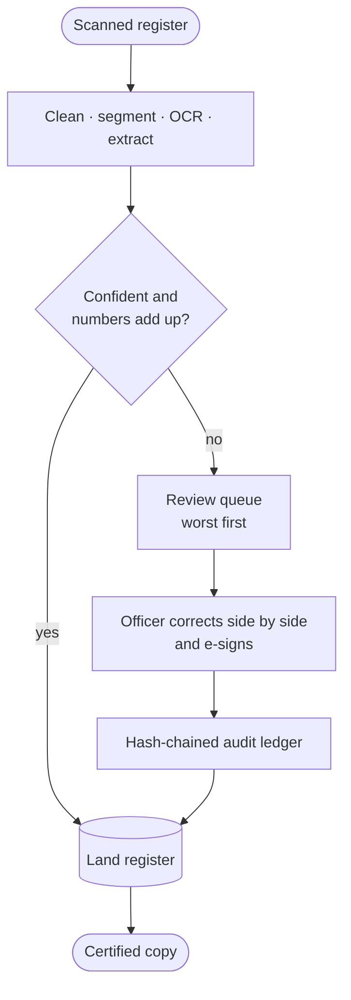
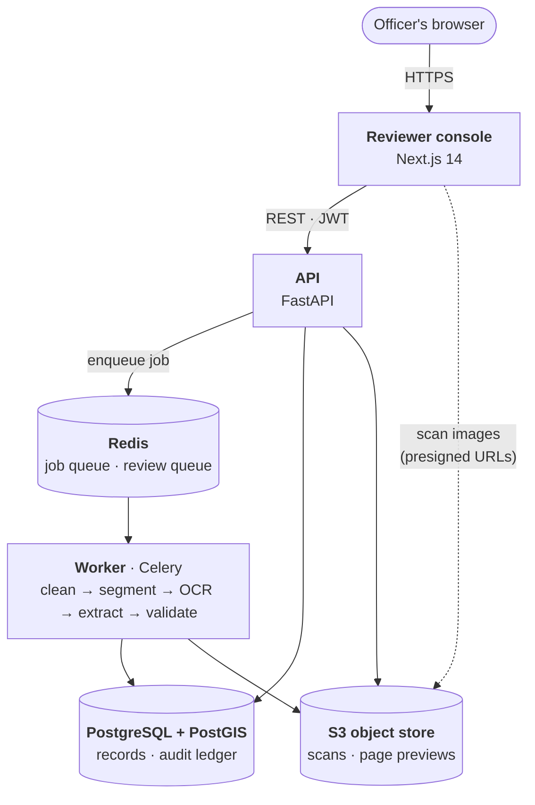

<div align="center">

# Bhu-Validate

**Intelligent land record digitisation and validation for India's revenue offices**

Smart India Hackathon 2026 · Problem Statement **SIH26018** · Ministry of Rural Development (DILRMP)

[](https://172-198-137-255.sslip.io)


[Try it](#try-it) ·
[Architecture](#architecture) ·
[Quick start](#quick-start) ·
[Deployment](docs/DEPLOYMENT.md) ·
[Demo script](docs/DEMO_SCRIPT.md)


</div>

## Try it

| | Link | Notes |
|---|---|---|
| 🌐 **Live demo** (Azure) | **https://172-198-137-255.sslip.io** | Always on — nothing to install |
| 💻 **Run locally** | **http://localhost:3000** | After the [quick start](#quick-start) below; API docs at http://localhost:8000/docs |

Sign in to either with a demo account:

| Role | User ID | Password |
|---|---|---|
| Patwari | `patwari.demo` | `patwari@123` |
| Tehsildar | `tehsildar.demo` | `tehsildar@123` |

> The live demo is a public sandbox with synthetic records — please don't upload
> real land records or personal data.

---

## The problem

Records of Rights — Jamabandi, 7/12 extracts, Khatauni — sit in tehsil record
rooms as folded, faded, handwritten paper, in many scripts and in regional units
of area that don't agree with each other. Digitising them with OCR alone is not
enough: a record can be read at 99% confidence and still be wrong.

**Bhu-Validate treats arithmetic as the test of truth.** Parcels must add up to
the declared holding and ownership shares must close at 100%. Records that are
confident *and* consistent commit themselves; everything else goes to an
officer, worst first, in a side-by-side editor built for long working days.

## Features

- **Reads difficult scans** — deskew, bleed-through removal, Sauvola
  binarisation and fold repair before OCR (PaddleOCR, with Tesseract for Hindi,
  Marathi and English built in, so it works fully offline).
- **Checks the numbers** — area and share invariants, duplicate survey numbers,
  missing owners, and region-aware unit conversion (a Bigha in Meerut is not a
  Bigha in Patna).
- **Human review only where needed** — confident, consistent records
  auto-commit; the rest are queued lowest-confidence first.
- **Side-by-side editor** — every detected field is boxed on the scan; focusing
  a field zooms to it. Multi-page PDFs and TIFFs with a page switcher.
- **Role-based sign-off** — Patwaris verify; only a Tehsildar can sign a record
  with a failing check, and the override is recorded.
- **Tamper-evident audit ledger** — every correction is hash-chained; the
  database refuses edits and deletes to history.
- **Certified copy** — a printable, bilingual Record of Rights with the signer,
  date and digital seal.
- **Seven Indian languages** — Hindi, Bengali, Marathi, Telugu, Tamil, Gujarati
  and Kannada, always shown beside English, with large, high-contrast text.

<table>
  <tr>
    <td width="50%"></td>
    <td width="50%"></td>
  </tr>
  <tr>
    <td align="center"><sub>Language chooser after sign-in</sub></td>
    <td align="center"><sub>Certified copy of a signed record</sub></td>
  </tr>
</table>

## How it works



```
C_total = 0.5 · OCR + 0.3 · Layout + 0.2 · MathChecksPassed
auto-commit  ⇔  C_total ≥ 0.85  and  no critical finding
```

## Architecture



| Part | Technology | Role |
|---|---|---|
| Reviewer console | Next.js 14, TypeScript, Tailwind | Sign-in, language choice, upload, review queue, side-by-side editor, e-sign, certified copy |
| API | FastAPI, SQLAlchemy 2, Pydantic 2 | Auth (bcrypt + JWT), upload and de-duplication, review, validation on save, exports |
| Worker | Celery, OpenCV, PaddleOCR, Tesseract | Restores and reads each scan off the request path; stores per-page previews |
| Database | PostgreSQL 16 + PostGIS | Records, parcel geometry, users, append-only hash-chained audit ledger |
| Queue | Redis 7 | Job broker; review queue ordered by confidence |
| Object store | SeaweedFS (S3 API) | Original scans and page images |

In production (the live demo) the whole stack runs as one container behind
Caddy for automatic HTTPS on a single Azure VM.

**Deep dive — [docs/ARCHITECTURE.md](docs/ARCHITECTURE.md):**
[upload-to-review sequence](docs/ARCHITECTURE.md#ingestion-pipeline) ·
[record lifecycle](docs/ARCHITECTURE.md#record-lifecycle) ·
[validation rules](docs/ARCHITECTURE.md#validation-and-confidence) ·
[data model](docs/ARCHITECTURE.md#data-model) ·
[audit ledger](docs/ARCHITECTURE.md#audit-ledger) ·
[security](docs/ARCHITECTURE.md#security) ·
[deployment](docs/ARCHITECTURE.md#deployment-topologies) ·
[design decisions](docs/ARCHITECTURE.md#design-decisions)

## Quick start

Requires Docker. Everything runs locally; no paid API or internet access is
needed after the images are built.

```bash
git clone https://github.com/tejas0407/SIH.git && cd SIH
cp .env.example .env
docker compose up --build
docker compose exec backend python -m app.seed.load_demo   # demo accounts + records
```

Open **http://localhost:3000** and sign in with a [demo account](#try-it):

| Role | Can |
|---|---|
| Patwari | Review, correct and sign records that pass every check |
| Tehsildar | Also sign records with a failing check (recorded as an override) |

API documentation is served at http://localhost:8000/docs.

### Demo records

The seed renders three **synthetic** register pages (real records contain
citizens' personal data):

| Record | Page | Outcome |
|---|---|---|
| Khata 142 | Maharashtra 7/12, clean | 97% confidence, numbers close — commits with no human involved |
| Khata 87 | Western UP Khatauni, rotated, folded, faded | Restored to 0° skew; 81% confidence, so it goes to review |
| Khata 305 | Bihar Jamabandi | Clean print, 94% OCR — but parcels total 1.15 ha against 1.00 ha declared, so it is blocked until a Tehsildar decides |

## Tech stack

| Layer | Technology |
|---|---|
| Frontend | Next.js 14, TypeScript, Tailwind CSS, TanStack Query, Zustand |
| API | FastAPI, SQLAlchemy 2, Pydantic 2, JWT + bcrypt |
| Processing | Celery, OpenCV, scikit-image, PaddleOCR, Tesseract |
| Data | PostgreSQL 16 + PostGIS, Redis, SeaweedFS (S3) |
| Delivery | Docker, Caddy (automatic HTTPS), nginx, supervisord |

## Project structure

```
backend/     FastAPI API, Celery worker, CV/OCR pipeline, SQL migrations, tests
frontend/    Next.js reviewer console
deploy/      production: all-in-one image, VM setup with HTTPS, DigitalOcean spec
docs/        architecture, deployment guide, demo script, screenshots
```

## Deployment

The live demo runs on a single Azure VM using `deploy/vm` — one command sets up
Docker, HTTPS and the whole stack, with data kept across restarts. See
**[docs/DEPLOYMENT.md](docs/DEPLOYMENT.md)** for Azure for Students (free, no
card), any other Ubuntu VM, and DigitalOcean App Platform.

## Testing

```bash
docker compose exec backend pytest -q     # 40 tests
```

The suite runs without any OCR model on disk and covers unit conversion and
regional ambiguity, ULPIN integrity, every validation rule, deskew accuracy
against known rotations, binarisation under uneven lighting, table detection
on a degraded page, and the authentication crypto.

---

<div align="center">
<sub>Built for Smart India Hackathon 2026 · Department of Land Resources, Ministry of Rural Development.
Not an official Government of India service.</sub>
</div>
