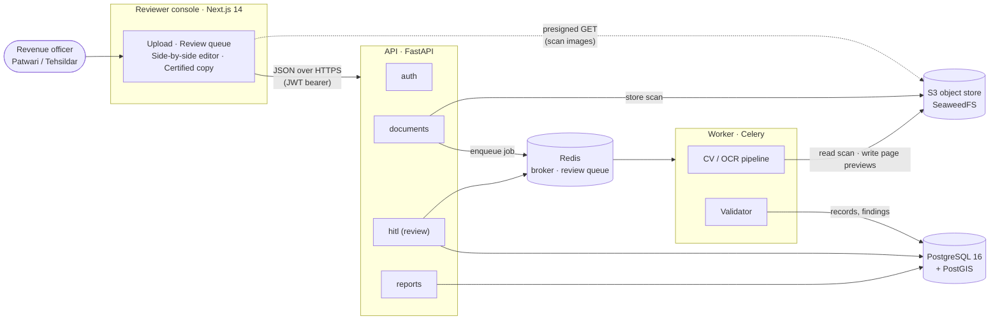
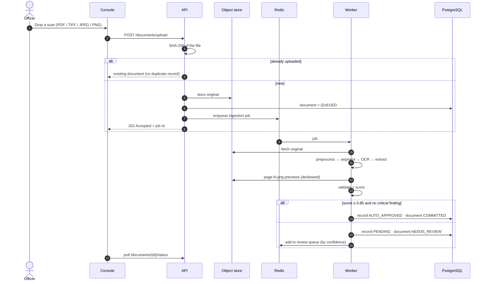
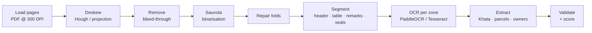
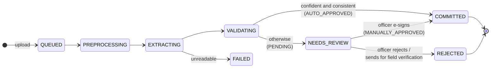
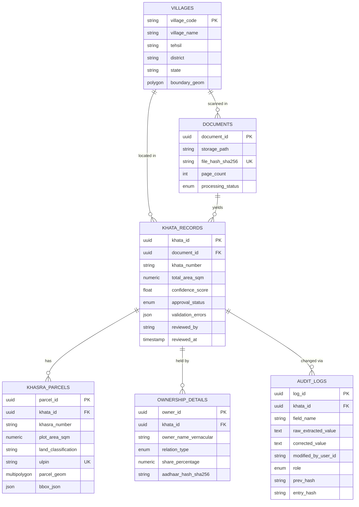
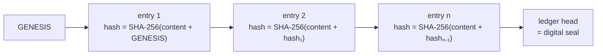
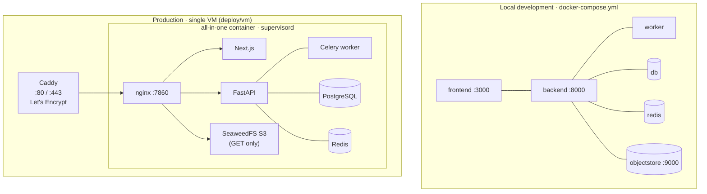

# Architecture

Bhu-Validate turns a scanned Record of Rights into a validated, signed,
tamper-evident land record. This document describes how the system is put
together and why.

- [System overview](#system-overview)
- [Components](#components)
- [Ingestion pipeline](#ingestion-pipeline)
- [Record lifecycle](#record-lifecycle)
- [Validation and confidence](#validation-and-confidence)
- [Data model](#data-model)
- [Audit ledger](#audit-ledger)
- [Security](#security)
- [Deployment topologies](#deployment-topologies)
- [Design decisions](#design-decisions)

---

## System overview



The browser never talks to the database or the queue. Scan images are the one
exception to "everything through the API": the API hands the browser a
short-lived presigned URL, and the image bytes come straight from the object
store.

## Components

| Component | Technology | Responsibility |
|---|---|---|
| **Reviewer console** | Next.js 14 (App Router), TypeScript, Tailwind, TanStack Query, Zustand | Sign-in, language choice, upload, review queue, side-by-side scan editor, e-sign, certified copy. Bilingual UI (7 Indian languages beside English). |
| **API** | FastAPI, SQLAlchemy 2 (async), Pydantic 2 | Authentication (bcrypt + JWT), upload and de-duplication, review endpoints, validation on save, exports. |
| **Worker** | Celery 5 | Runs the CV/OCR pipeline off the request path and writes results. |
| **CV / OCR pipeline** | OpenCV, scikit-image, PaddleOCR, Tesseract (hin/mar/eng), optional TrOCR | Deskew, clean, segment and read the page; extract Khata, parcels and owners with bounding boxes. |
| **Validator** | Pure Python | Arithmetic and format invariants, regional unit conversion, confidence scoring. |
| **Database** | PostgreSQL 16 + PostGIS 3 | Records, geometry, users and the append-only audit ledger. |
| **Queue / cache** | Redis 7 | Celery broker and results; review queue ordered by confidence. |
| **Object store** | SeaweedFS (S3 API) | Original scans, per-page preview images. |

### Repository layout

```
backend/              FastAPI API, Celery worker, CV pipeline, migrations, tests
  app/api/v1/         auth · documents · hitl · reports
  app/services/       cv_pipeline · validator · units · ulpin · audit · storage · auth
  app/workers/        Celery app, tasks, review queue
  app/models/         SQLAlchemy models        app/schemas/  Pydantic DTOs
  app/seed/           synthetic demo scans, demo loader, migration runner
  migrations/         SQL schema (PostGIS, enums, audit triggers)
  tests/              pytest suite
frontend/             Next.js reviewer console
  app/                login · language · home · queue · review/[id] · record/[id]
  components/         DocumentViewer · ReviewForm · SignModal · gov/ (portal chrome)
  lib/                api client · auth · i18n · state · types
deploy/
  all-in-one/         single-container image (supervisord + nginx) for one VM
  vm/                 Compose + Caddy (HTTPS) + setup script for any Ubuntu VM
  digitalocean/       App Platform spec (managed Postgres/Redis, Spaces)
docs/                 architecture, deployment, demo script
docker-compose.yml    local development stack
```

## Ingestion pipeline



### Pipeline stages



Every extracted field keeps its **bounding box on the deskewed page**. The
worker stores that same deskewed page as `processed-tiles/{document}/page-N.png`,
so the boxes drawn in the review screen line up exactly, whatever the original
format or skew.

## Record lifecycle



A reviewer's save does four things in **one transaction**: write each change to
the audit ledger, apply the corrections, re-run every invariant on the corrected
values, and set the approval state. If a critical invariant still fails, only a
**Tehsildar** can sign — and that override is itself recorded in the ledger.

## Validation and confidence

```
C_total = 0.5 · OCR + 0.3 · Layout + 0.2 · MathChecksPassed
```

A record commits itself only when **C_total ≥ 0.85 and there is no critical
finding**. The two conditions are independent: a perfectly printed page whose
parcels don't add up to the declared holding still goes to a human.

| Rule | Severity | Check |
|---|---|---|
| `AREA_SUM_MISMATCH` | Critical | Parcel areas sum to the Khata total (±0.005 m²) |
| `INVALID_OWNER_SHARES` | Critical | Owner shares sum to 100% (±0.01%) |
| `DUPLICATE_KHASRA` | Critical | No survey number appears twice |
| `NON_POSITIVE_AREA` | Critical | Every parcel has a positive area |
| `ORPHAN_OWNER` | Critical | The Khata has at least one owner |
| `MISSING_KHATA_NUMBER` | Critical | The Khata number was read |
| `INVALID_KHASRA_FORMAT` | Warning | Survey number format (Indic sub-division suffixes allowed) |
| `ULPIN_INVALID` | Warning | ULPIN check character |
| `LOW_FIELD_CONFIDENCE` | Warning | Any field read below 50% |

**Regional units.** Areas are normalised to m² before any arithmetic, and
conversions resolve against the record's state and district — a Bigha in
Meerut (2,529.3 m²) is not a Bigha in Patna (1,618.7 m²). Compound expressions
such as `2 बीघा 10 बिस्वा` parse as printed, and Devanagari numerals are folded
to ASCII first. Unknown regions are refused rather than guessed.

**ULPIN (Bhu-Aadhaar).** 14 characters: a 2-character state code, an
11-character geohash of the parcel centroid and a weighted modulo-32 check
character — reproducible from geometry alone and self-checking at the counter.

## Data model



`users` (login, bcrypt hash, role) sits alongside; its role reuses the ledger's
`actor_role` enum, so the person signed in is exactly the person the ledger
names.

## Audit ledger



- Each correction stores its own SHA-256 and the previous entry's hash.
- PostgreSQL triggers reject `UPDATE` and `DELETE` on `audit_logs`.
- `GET /hitl/{id}/ledger` recomputes the chain and names the exact entry where
  it breaks; the certified copy shows the result and the head hash as the seal.

## Security

| Concern | Measure |
|---|---|
| Authentication | bcrypt password hashes; 12-hour JWT; every write takes the actor and role from the token, never from the request body |
| Authorisation | Only a Tehsildar can sign a record with a failing critical check; the override is ledgered |
| Integrity | Hash-chained, append-only ledger enforced by database triggers |
| Personal data | Aadhaar is never stored — only a salted SHA-256 digest, enough to detect duplicates |
| Scan access | Short-lived presigned URLs; public paths are read-only (GET/HEAD) and object-store keys are random per boot on the VM image |
| Transport | HTTPS via Caddy with automatic Let's Encrypt certificates |
| Secrets | Generated on the server at first deploy; never committed |

## Deployment topologies



| | Local | Single VM (live) | DigitalOcean App Platform |
|---|---|---|---|
| Files | `docker-compose.yml` | `deploy/vm`, `deploy/all-in-one` | `deploy/digitalocean/app.yaml` |
| Services | one container each | one container + Caddy | managed Postgres/Redis, Spaces |
| HTTPS | — | automatic (sslip.io host) | platform-managed |
| Cost | free | free on Azure for Students credit | paid |

Setup steps for each are in [DEPLOYMENT.md](DEPLOYMENT.md).

## Design decisions

- **Arithmetic over OCR confidence.** A land record is trustworthy when its
  numbers close, not when the OCR is confident. Scoring and gating are kept
  separate so a clean-looking but inconsistent record can never auto-commit.
- **Human in the loop by exception.** Consistent, confident records commit
  themselves; the review queue is ordered worst-first so officers spend time
  where it matters.
- **Offline by default.** Tesseract with Hindi, Marathi and English is baked
  into the image, so the pipeline works with no internet and no paid API.
- **Certified copy rendered in the browser.** Server-side PDF libraries mis-shape
  Indic scripts; the browser renders them correctly and prints to A4 PDF.
- **Open, S3-compatible storage.** SeaweedFS replaced MinIO when MinIO stopped
  publishing free images; the code talks plain S3, so any S3 store (including
  DigitalOcean Spaces) works unchanged.
- **Synthetic demo data.** Real Records of Rights carry citizens' personal data,
  so the demo pages are generated with the same layout grammar and run the
  exact same code paths.
